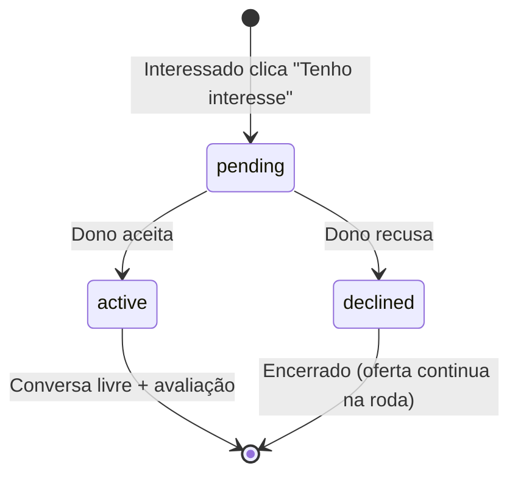
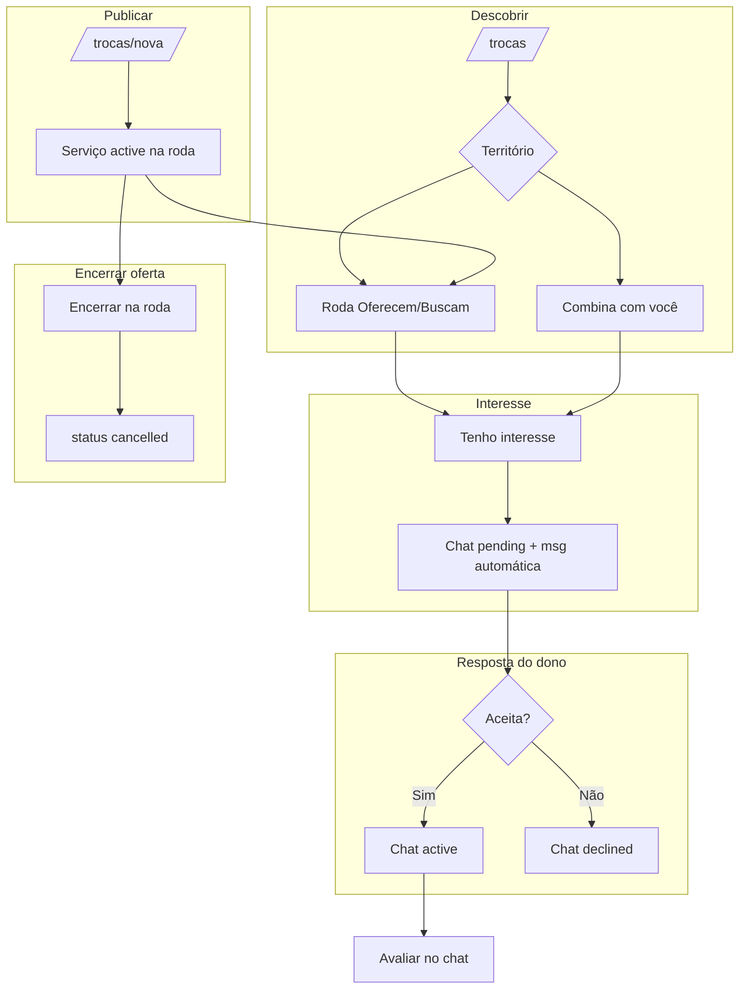

# Fluxo de Trocas — Jornada dos usuários

Como funciona a **roda de trocas** no Tekoa hoje: publicar, descobrir, demonstrar interesse, combinar no chat e encerrar. Este documento descreve o comportamento **implementado** no app (não o plano original de swipe).

---

## Princípios do fluxo

1. **Território primeiro** — por padrão você vê a roda da sua comunidade; pode abrir para outros territórios.
2. **Não exclusivo** — várias pessoas podem demonstrar interesse na mesma oferta; ela só sai da roda quando o autor **encerra**.
3. **Match no chat** — não há “curtir/passar”. O combinado nasce quando o dono da oferta **aceita** o interesse.
4. **Reciprocidade sugerida, não obrigatória** — a mensagem automática lista o que você **oferece** na roda, se tiver; mas você pode demonstrar interesse mesmo sem publicação própria.

---

## Papéis na jornada

| Papel | Exemplo | O que faz no app |
|-------|---------|------------------|
| **Publicador** | Maria oferece aula de violão | Cria oferta/pedido, gerencia em Minhas trocas, aceita ou recusa interesses |
| **Interessado** | Felipe quer a aula | Navega a roda, vê sugestões, demonstra interesse, aguarda aceite |
| **Os dois** | Quem oferece e também busca | Pode ter publicações ativas **e** interesses enviados ao mesmo tempo |

---

## Mapa de rotas

```
/dashboard          → atalho para trocas recentes do território
/trocas             → roda + sugestões "Combina com você"
/trocas/nova        → publicar oferta ou pedido
/trocas/minhas      → suas publicações + interesses recebidos/enviados
/mensagens          → lista de conversas (interesses e trocas combinadas)
/mensagens/[id]     → chat (pendente, ativo ou recusado)
/perfil             → link para Minhas trocas
```

---

## Jornada 1 — Publicar na roda

**Quem:** vizinho que quer oferecer ou buscar um serviço.

```
Perfil com comunidade definida
        ↓
/trocas/nova
        ↓
Escolhe: Ofereço  |  Busco
Preenche título, descrição, categoria, proximidade
Escolhe alcance: só minha quebrada | territórios escolhidos | todos
        ↓
Publicar na roda
        ↓
Serviço criado (status: active, reach: own por padrão)
        ↓
Aparece em /trocas (Oferecem ou Buscam) para quem enxerga o território
```

**Regras:**
- A `community` da publicação vem do `location` do perfil.
- Novas publicações nascem com `reach = own` (só no território), salvo se o autor escolher outro alcance.
- O autor vê a própria publicação na roda (sem botão “Tenho interesse” no card dele).

**Gestão depois** (`/trocas/minhas`):
- **Encerrar na roda** → `status = cancelled` (some dos feeds).
- **Remover** → exclui o registro.

---

## Jornada 2 — Descobrir trocas

**Quem:** vizinho explorando o que a comunidade (ou a rede) oferece e busca.

```
/trocas
        ↓
[Filtro territorial]  Minha comunidade  |  Outros territórios
        ↓
[Combina com você]     ← só se EU tenho serviço(s) ativo(s)
                       ← algoritmo cruza meu tipo/categoria com o da vizinhança
        ↓
[Roda da comunidade]   Toggle: Oferecem  |  Buscam
        ↓
Cards com autor, categoria, descrição, "Tenho interesse"
```

### Como o feed territorial funciona

Na **minha comunidade**, entram publicações em que:
- `reach = all` (todos os territórios), ou
- `community` = minha comunidade, ou
- minha comunidade está em `reach_communities`.

Em **Outros territórios** (`?territorio=todos`), o filtro territorial é desligado.

### "Combina com você"

Sugestões automáticas quando você tem ao menos um serviço **ativo** e existe na roda alguém com:
- **tipo oposto** (sua oferta ↔ pedido dele, ou vice-versa),
- **mesma categoria**,
- **usuário diferente**.

O score considera afinidade de texto e proximidade declarada (`lib/matching/match.ts`). É **sugestão**, não bloqueio: você pode ignorar e ir direto na roda.

---

## Jornada 3 — Demonstrar interesse

**Quem:** Felipe viu a oferta "Aula de violão" da Maria.

```
Card na roda → "Tenho interesse"
        ↓
Sistema verifica:
  • serviço existe e está active
  • não é meu serviço
  • ainda não tenho chat declined neste serviço
        ↓
Cria chat (status: pending, initiated_by: Felipe)
Vincula service_id da oferta da Maria
        ↓
Mensagem automática de Felipe:
  • sem ofertas suas → "Oi! Felipe tem interesse em «Aula de violão»."
  • com ofertas     → lista o que pode oferecer em troca
        ↓
Redireciona para /mensagens/[chatId]
```

**Se já havia interesse pendente ou aceito** no mesmo serviço → reabre a mesma conversa.

**Se foi recusado antes** → não permite novo interesse nessa oferta (a oferta continua na roda para outros).

### Estados do chat de troca



| Status | Interessado | Dono do serviço |
|--------|-------------|-----------------|
| `pending` | Vê mensagem enviada; **não** pode digitar | Vê botões **Aceitar** / **Recusar**; **não** pode digitar |
| `active` | Conversa livre | Conversa livre; pode avaliar depois |
| `declined` | Banner "recusado"; sem envio | Histórico visível; sem envio |

---

## Jornada 4 — Dono recebe e responde

**Quem:** Maria, dona da oferta de violão.

```
Notificação implícita: conversa aparece em /mensagens
  rótulo "Novo interesse" na lista
        ↓
/trocas/minhas → seção "Interesses recebidos"
  (contador na publicação se pending)
        ↓
Abre /mensagens/[id]
        ↓
Lê mensagem automática de Felipe
        ↓
    ┌───────────────┴───────────────┐
    ▼                               ▼
 Aceitar interesse              Recusar
    │                               │
    ▼                               ▼
 status → active              status → declined
 mensagem de aceite           mensagem educada
 conversa liberada           oferta continua na roda
```

**Importante:** aceitar um interesse **não** encerra a oferta nem impede outros interesses na mesma publicação.

---

## Jornada 5 — Combinar e avaliar

**Quem:** Felipe e Maria, após aceite.

```
Chat active
        ↓
Combinam horário, local, forma da troca (fora do app ou no chat)
        ↓
Header do chat → avaliar o outro (estrelas + comentário)
        ↓
Rating vinculado ao service_id da troca
```

Hoje **não há** botão “marcar troca como concluída” na UI — o ciclo `matched` / `completed` existe no banco mas não é usado na interface.

---

## Jornada 6 — Minhas trocas (painel do vizinho)

`/trocas/minhas` reúne três visões:

| Seção | Conteúdo |
|-------|----------|
| **Minhas publicações** | Todas as suas ofertas/pedidos, status, encerrar/remover, badge de interesses pendentes |
| **Interesses recebidos** | Quem quer combinar com **suas** ofertas → link para o chat |
| **Interesses enviados** | Onde **você** demonstrou interesse → aguardando, combinado ou recusado |

---

## Fluxo completo (visão única)



---

## Cenários comuns

### Só quero explorar, sem publicar
- Vê a roda e pode demonstrar interesse.
- **Não** vê "Combina com você" (precisa de âncora: seu serviço ativo).
- Mensagem automática será só "tem interesse em…", sem lista de ofertas.

### Tenho oferta e pedido ao mesmo tempo
- Ambos aparecem na roda.
- O matching pode sugerir parceiros para cada um.
- Interesses enviados/recebidos são independentes.

### Três pessoas interessadas na mesma aula de violão
- Três chats `pending` (um por interessado).
- Maria aceita uma, duas ou todas — cada aceite libera uma conversa.
- A oferta permanece `active` até Maria encerrar.

### Oferta de outro território
- Com toggle em "Minha comunidade", só aparece se o alcance permitir.
- Com "Outros territórios", vê toda a rede (respeitando `reach`).

### Recusa
- Interessado não pode insistir no mesmo serviço.
- Oferta continua visível para a comunidade.
- Outra pessoa pode demonstrar interesse normalmente.

---

## Referência técnica (para devs)

| Peça | Onde |
|------|------|
| Publicação | `createServiceAction`, `NewServiceForm` |
| Feed territorial | `territoryOrFilter`, páginas `/trocas` |
| Matching | `lib/matching/match.ts`, seção na página Trocas |
| Interesse | `startServiceChatAction`, `createServiceInterestChat` |
| Aceitar/recusar | `acceptServiceInterestAction`, `declineServiceInterestAction` |
| Mensagem automática | `lib/services/interest-intro.ts` |
| UI chat pendente | `ChatThread`, `InterestReplyBar` |
| Minhas trocas | `/trocas/minhas`, `MyTradesPanels` |
| Migração de estados | `migrations/005_interesses_trocas.sql` |

---

## O que ainda não faz parte da jornada

- Notificação push de novo interesse
- Editar publicação pela UI
- Marcar troca como concluída (`completed`) após o combinado
- Escolher qual oferta sua enviar na mensagem (hoje lista todas as ofertas ativas)
- Swipe / fila estilo Tinder

---

**Ver também:** [Estado-do-Projeto.md](Estado-do-Projeto.md) · [migrations/README.md](../migrations/README.md)

**Última atualização:** junho de 2026
